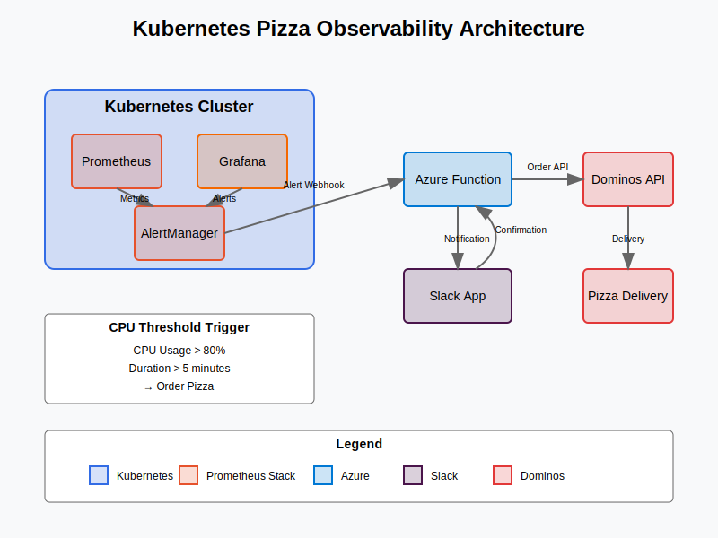
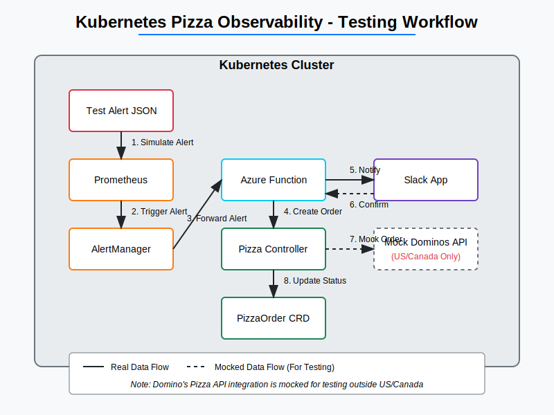

# Kubernetes Pizza Observability


## Vibe Check

Kubernetes Pizza Observability is a main-character energy project serving up pizza orders when your Kubernetes cluster's CPU usage exceeds a threshold. It combines infrastructure monitoring with real-world actions, demonstrating a fun and practical application of observability principles.

## The Tea 🍵



1. **Monitoring**: Prometheus continuously monitors CPU usage in your Kubernetes cluster
2. **Alerting**: When CPU usage exceeds 80% for 5 minutes, AlertManager triggers an alert
3. **Processing**: An Azure Function receives the alert and prepares a pizza order
4. **Confirmation**: Slack allows users to confirm or cancel order
5. **Ordering**: The system places an order with Domino's Pizza API
6. **Tracking**: The pizza order status is tracked through Kubernetes custom resources

## Architecture

```
Kubernetes Cluster
├── Workloads (Pods, Deployments, etc.)
├── Prometheus (Monitoring)
├── Grafana (Visualization & Alerting)
├── AlertManager (Alert Routing)
├── Azure Function (Alert Handler)
├── PizzaOrder CRD (Custom Resource Definition)
└── Slack App (Order Confirmation)
```

## Components

### Core Components

- **Prometheus & Grafana**: Monitors cluster metrics and visualizes CPU usage
- **AlertManager**: Routes alerts to the Azure Function
- **Azure Function**: Processes alerts and creates pizza orders
- **Pizza Controller**: Kubernetes controller that manages PizzaOrder custom resources
- **Slack App**: Provides a user interface for confirming pizza orders

## The Whole Aesthetic

### Prerequisites

- Kubernetes cluster (AKS, GKE, EKS, or local like Minikube/Kind)
- Helm 3.x
- kubectl configured to access your cluster
- Docker and Docker Compose (for local development)

### Installation

1. **Deploy Kubernetes Cluster**

   You can use the Terraform configuration in the `terraform` directory to deploy an AKS cluster:

   ```bash
   cd terraform
   terraform init
   terraform apply
   ```

2. **Deploy with Helm**

   ```bash
   # Add Prometheus Helm repository
   helm repo add prometheus-community https://prometheus-community.github.io/helm-charts
   helm repo update

   # Install the chart
   helm install k8s-pizza helm/k8s-pizza-observability-chart
   ```

3. **Configure Pizza Delivery Information**

   Create a values override file with your delivery information:

   ```bash
   cat > pizza-values.yaml << EOF
   dominosPayment:
     cardType: "Credit"
     cardNumber: "4100123456789010"
     cardExpiration: "01/25"
     cardSecurityCode: "123"
     cardPostalCode: "90210"

   azureFunction:
     env:
       CUSTOMER_FIRST_NAME: "Pizza"
       CUSTOMER_LAST_NAME: "Lover"
       CUSTOMER_EMAIL: "pizza@example.com"
       CUSTOMER_PHONE: "1234567890"
       DELIVERY_STREET: "123 Main St"
       DELIVERY_CITY: "Anytown"
       DELIVERY_STATE: "NY"
       DELIVERY_ZIP: "10001"
       PIZZA_SIZE: "large"
       PIZZA_TYPE: "pepperoni"
   EOF

   helm upgrade k8s-pizza helm/k8s-pizza-observability-chart -f pizza-values.yaml
   ```

4. **Verify Installation**

   ```bash
   # Check that all pods are running
   kubectl get pods

   # Access Grafana dashboard
   kubectl port-forward svc/k8s-pizza-grafana 3000:80
   ```

   Visit http://localhost:3000 and log in with username `admin` and password `pizza123`.

## It's Giving... 💅

### Test Alert

To test the system without waiting for actual high CPU usage:

```bash
# Send a test alert
kubectl apply -f kubernetes/pizza-test-alert.json
```

### API Limitations

**Note:** The complete end-to-end workflow could not be tested in real-time because the Domino's Pizza API works primarily in the US and Canada. The system is designed to work with the API but may require adjustments based on your location.

### Testing Workflow (Outside US/Canada)

Below is a visual representation of how the testing workflow operates outside the US and Canada:

1. **Generate Test Alert**: Use the test alert JSON to simulate high CPU usage
2. **Alert Processing**: The alert is processed by AlertManager and forwarded to the Azure Function
3. **Order Creation**: A PizzaOrder custom resource is created in the Kubernetes cluster
4. **Slack Notification**: A notification is sent to Slack for order confirmation
5. **Mock API Call**: For testing outside US/Canada, the API call is mocked
6. **Status Updates**: The Pizza Controller updates the order status in the cluster



### Actual Workflow (US/Canada)

In the US and Canada, the system would work with the actual Domino's Pizza API, resulting in real pizza deliveries:

1. **High CPU Detection**: Prometheus detects high CPU usage in the cluster
2. **Alert Triggering**: AlertManager triggers an alert when CPU exceeds threshold
3. **Order Processing**: The Azure Function processes the alert and creates an order
4. **User Confirmation**: Slack notification allows users to confirm the order
5. **Pizza Ordering**: The Pizza Controller places a real order with Domino's API
6. **Status Tracking**: Order status is tracked in the Kubernetes cluster
7. **Pizza Delivery**: A real pizza is delivered to your specified address


For a complete test in supported regions, replace the mock API call with an actual Domino's API call.

## Docker Compose (Local Development)

For local development without a Kubernetes cluster:

```bash
# Build and start all components
docker-compose up -d

# View logs
docker-compose logs -f
```

## Project Structure

```
├── azure-function/       # Azure Function for processing alerts
├── docs/                 # Documentation and diagrams
├── helm/                 # Helm chart for Kubernetes deployment
├── kubernetes/           # Kubernetes manifests and samples
│   ├── controller/       # Pizza Order controller implementation
│   ├── crds/             # Custom Resource Definitions
│   └── samples/          # Sample resources
├── scripts/              # Utility scripts
├── slack/                # Slack app for order confirmation
└── terraform/            # Infrastructure as Code for cloud deployment
```

Each directory contains its own README with detailed information.

## Component Details

### Azure Function

The Azure Function receives alerts from Prometheus/AlertManager and creates PizzaOrder custom resources in the Kubernetes cluster. See the [Azure Function README](./azure-function/README.md) for more details.

### Slay the Kubernetes Way 👑

The Pizza Order Controller is a Kubernetes controller that manages PizzaOrder custom resources. It processes orders by finding the nearest Dominos store, creating an order, and tracking its status. See the [Controller README](./kubernetes/controller/README.md) for more details.

### Helm Charts

The Helm charts provide a streamlined way to deploy all components of the system. See the [Helm README](./helm/README.md) for more details on configuration options.

### Terraform Infrastructure

The Terraform configuration creates the necessary cloud infrastructure for the project. See the [Terraform README](./terraform/README.md) for more details on deployment options.

### Slack Integration

The Slack app provides a user interface for receiving notifications and confirming pizza orders. See the [Slack README](./slack/README.md) for more details on setup and configuration.

## Troubleshooting

### Common Issues

- **Prometheus not receiving metrics**: Check that the Prometheus service can reach your pods
- **AlertManager not sending alerts**: Verify the AlertManager configuration and webhook URL
- **Azure Function not processing alerts**: Check the function logs and environment variables
- **Pizza Controller not creating orders**: Ensure the controller has the necessary permissions
- **Slack app not receiving notifications**: Verify the webhook URL and app configuration

### Logs

Check component logs for detailed error information:

```bash
# Azure Function logs
az functionapp log tail --name pizza-order-function --resource-group pizza-function-rg

# Pizza Controller logs
kubectl logs -f deployment/pizza-controller

# Slack app logs
kubectl logs -f deployment/slack-app
```

## Security Considerations

- Store sensitive information (like payment details) in Kubernetes Secrets
- Use HTTPS for all external communications
- Implement proper authentication for the Azure Function
- Consider using a service mesh for additional security features

## Contributing

Contributions are welcome! Please feel free to submit a Pull Request.

## License

This project is unlicensed.