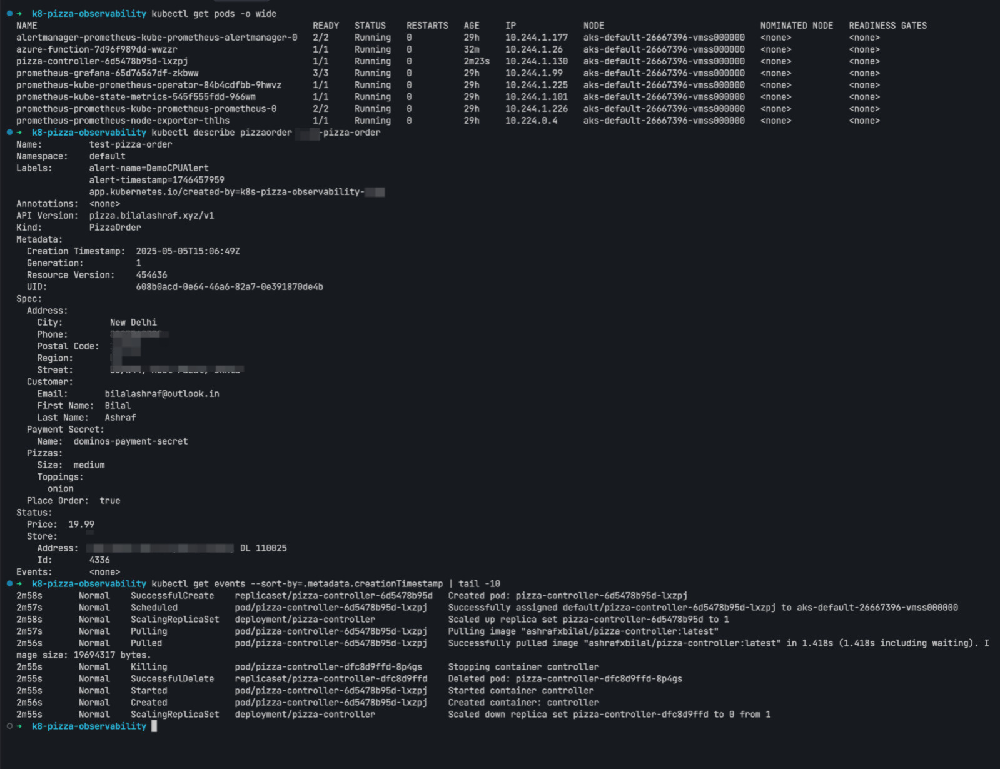

Created by Bilal

  <h1>Kubernetes Pizza Observability</h1>
  
Order pizza automatically when your Kubernetes cluster is under high load!

  

    <h2 class="card-title">Overview</h2>
    
Kubernetes Pizza Observability is a fun yet practical project that combines infrastructure monitoring with automated pizza ordering. When your Kubernetes cluster experiences high CPU load, the system automatically orders pizza for your team to enjoy while they work on resolving the issues.

    

      🍕 0
      🚀 0
      🔥 0
    

  

  
  

    <h3 class="card-title">Inspiration</h3>
    
This project was inspired by the <a href="https://nat-henderson.github.io/terraform-provider-dominos/" class="tooltip" data-tooltip="Visit Terraform Dominos Provider">Terraform Dominos Provider</a> created by Nat Henderson.

  

  
  

    <h3 class="card-title">Quick Start</h3>
    
Get started in minutes with our Helm chart:

    <pre><code>helm install pizza-observability ./helm/k8s-pizza-observability-chart</code></pre>
  

## Architecture

  <svg xmlns="http://www.w3.org/2000/svg" viewBox="0 0 800 400" width="100%" height="300">
    <!-- Kubernetes Cluster Box -->
    <rect x="50" y="50" width="700" height="300" rx="10" fill="#F1F2F6" stroke="#326CE5" stroke-width="2"/>
    <text x="400" y="80" font-family="'Inter', sans-serif" font-size="18" font-weight="bold" text-anchor="middle" fill="#326CE5">Kubernetes Cluster</text>
    
    <!-- Workloads -->
    <rect x="100" y="100" width="150" height="60" rx="5" fill="white" stroke="#6C5CE7" stroke-width="2"/>
    <text x="175" y="135" font-family="'Inter', sans-serif" font-size="14" text-anchor="middle" fill="#2D3436">Workloads</text>
    <text x="175" y="155" font-family="'Inter', sans-serif" font-size="12" text-anchor="middle" fill="#6C5CE7">(Pods, Deployments)</text>
    
    <!-- Prometheus -->
    <rect x="100" y="180" width="150" height="60" rx="5" fill="white" stroke="#FF4757" stroke-width="2"/>
    <text x="175" y="215" font-family="'Inter', sans-serif" font-size="14" text-anchor="middle" fill="#2D3436">Prometheus</text>
    <text x="175" y="235" font-family="'Inter', sans-serif" font-size="12" text-anchor="middle" fill="#FF4757">(Monitoring)</text>
    
    <!-- Grafana -->
    <rect x="100" y="260" width="150" height="60" rx="5" fill="white" stroke="#2ED573" stroke-width="2"/>
    <text x="175" y="295" font-family="'Inter', sans-serif" font-size="14" text-anchor="middle" fill="#2D3436">Grafana</text>
    <text x="175" y="315" font-family="'Inter', sans-serif" font-size="12" text-anchor="middle" fill="#2ED573">(Visualization)</text>
    
    <!-- AlertManager -->
    <rect x="300" y="100" width="150" height="60" rx="5" fill="white" stroke="#FFCC29" stroke-width="2"/>
    <text x="375" y="135" font-family="'Inter', sans-serif" font-size="14" text-anchor="middle" fill="#2D3436">AlertManager</text>
    <text x="375" y="155" font-family="'Inter', sans-serif" font-size="12" text-anchor="middle" fill="#FFCC29">(Alert Routing)</text>
    
    <!-- Azure Function -->
    <rect x="300" y="180" width="150" height="60" rx="5" fill="white" stroke="#1E90FF" stroke-width="2"/>
    <text x="375" y="215" font-family="'Inter', sans-serif" font-size="14" text-anchor="middle" fill="#2D3436">Azure Function</text>
    <text x="375" y="235" font-family="'Inter', sans-serif" font-size="12" text-anchor="middle" fill="#1E90FF">(Alert Handler)</text>
    
    <!-- PizzaOrder CRD -->
    <rect x="300" y="260" width="150" height="60" rx="5" fill="white" stroke="#FF2E63" stroke-width="2"/>
    <text x="375" y="295" font-family="'Inter', sans-serif" font-size="14" text-anchor="middle" fill="#2D3436">PizzaOrder CRD</text>
    <text x="375" y="315" font-family="'Inter', sans-serif" font-size="12" text-anchor="middle" fill="#FF2E63">(Custom Resource)</text>
    
    <!-- Slack App -->
    <rect x="500" y="180" width="150" height="60" rx="5" fill="white" stroke="#00D2D3" stroke-width="2"/>
    <text x="575" y="215" font-family="'Inter', sans-serif" font-size="14" text-anchor="middle" fill="#2D3436">Slack App</text>
    <text x="575" y="235" font-family="'Inter', sans-serif" font-size="12" text-anchor="middle" fill="#00D2D3">(Order Confirmation)</text>
    
    <!-- Connection Lines -->
    <path d="M175,160 L175,180" stroke="#6C5CE7" stroke-width="2" stroke-dasharray="5,5"/>
    <path d="M175,240 L175,260" stroke="#FF4757" stroke-width="2" stroke-dasharray="5,5"/>
    <path d="M250,130 L300,130" stroke="#6C5CE7" stroke-width="2" stroke-dasharray="5,5"/>
    <path d="M250,210 L300,210" stroke="#FF4757" stroke-width="2" stroke-dasharray="5,5"/>
    <path d="M375,160 L375,180" stroke="#FFCC29" stroke-width="2" stroke-dasharray="5,5"/>
    <path d="M375,240 L375,260" stroke="#1E90FF" stroke-width="2" stroke-dasharray="5,5"/>
    <path d="M450,210 L500,210" stroke="#1E90FF" stroke-width="2" stroke-dasharray="5,5"/>
  </svg>

  

    <h3 class="card-title">Kubectl in Action</h3>
    
    
<em>Managing Kubernetes resources with kubectl</em>

  

  
  

    <h3 class="card-title">Slack Notifications</h3>
    
    
<em>Example of a Slack notification for pizza order confirmation</em>

  

## Workflow

  

    <h3 class="card-title">1. Monitor</h3>
    
Prometheus monitors your Kubernetes cluster metrics

  

  
  

    <h3 class="card-title">2. Alert</h3>
    
When CPU usage exceeds the configured threshold, an alert is triggered

  

  
  

    <h3 class="card-title">3. Route</h3>
    
AlertManager routes the alert to the Azure Function

  

  
  

    <h3 class="card-title">4. Create</h3>
    
The Azure Function creates a PizzaOrder custom resource

  

  
  

    <h3 class="card-title">5. Order</h3>
    
The Pizza Controller processes the order and communicates with the Dominos API

  

  
  

    <h3 class="card-title">6. Notify</h3>
    
A Slack notification is sent for order confirmation

  

  
  

    <h3 class="card-title">7. Deliver</h3>
    
Pizza is delivered to your specified address

  

## Components

  

    <h3 class="card-title">Prometheus & Grafana</h3>
    
Monitors cluster metrics and visualizes CPU usage in real-time dashboards

  

  
  

    <h3 class="card-title">AlertManager</h3>
    
Routes alerts to the Azure Function when CPU thresholds are exceeded

  

  
  

    <h3 class="card-title">Azure Function</h3>
    
Serverless function that receives alerts and creates PizzaOrder custom resources

  

  
  

    <h3 class="card-title">Custom Resource Definition</h3>
    
Defines the PizzaOrder resource type in your Kubernetes cluster

  

  
  

    <h3 class="card-title">Pizza Controller</h3>
    
Kubernetes controller that watches for PizzaOrder resources and processes them

  

  
  

    <h3 class="card-title">Slack App</h3>
    
Sends notifications about pizza orders and delivery status

  

## Installation

  

    <h3 class="card-title">Prerequisites</h3>
    <ul>
      <li>Kubernetes cluster (v1.16+)</li>
      <li>Helm 3</li>
      <li>Prometheus & AlertManager</li>
      <li>Azure subscription (for Azure Function)</li>
      <li>Slack workspace with admin access</li>
      <li>Dominos account with payment method</li>
    </ul>
  

  
  

    <h3 class="card-title">Helm Installation</h3>
    <pre><code>git clone https://github.com/yourusername/k8s-pizza-observability.git
cd k8s-pizza-observability
helm install pizza-observability ./helm/k8s-pizza-observability-chart</code></pre>
  

  
  

    <h3 class="card-title">Configuration</h3>
    
Edit the <code>values.yaml</code> file to configure:

    <ul>
      <li>Dominos API credentials</li>
      <li>Delivery address</li>
      <li>Pizza preferences</li>
      <li>CPU threshold for alerts</li>
      <li>Slack webhook URL</li>
    </ul>
  

## Contributing

  <h3 class="card-title">How to Contribute</h3>
  
We welcome contributions to the Kubernetes Pizza Observability project! Here's how you can help:

  <ol>
    <li>Fork the repository</li>
    <li>Create a feature branch</li>
    <li>Make your changes</li>
    <li>Submit a pull request</li>
  </ol>
  
Please ensure your code follows our style guidelines and includes appropriate tests.

  
© 2023 Kubernetes Pizza Observability

  

    <a href="https://github.com/yourusername/k8s-pizza-observability" class="footer-link">GitHub</a>
    <a href="https://twitter.com/yourusername" class="footer-link">Twitter</a>
    <a href="mailto:your.email@example.com" class="footer-link">Contact</a>
  

